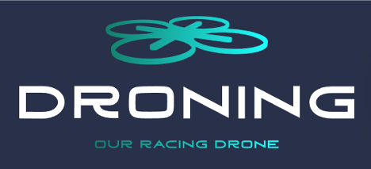

# DRONING



# Repository Name

## Overview
This repository contains the project files for the development of an Autonomous Racing Drone based on vision. The project focuses on implementing control systems, perception systems for gate detection using conventional vision and artificial intelligence, and utilizing a simulator for testing and refinement. The repository is organized into the following directories:

## Directories

- Control: Contains the code and documentation related to the control systems of the drone. <!--Please refer to the [Control/README.md](Control/README.md) file for detailed information about the control algorithms, maneuvering, stabilization, and flight characteristics. -->

- Exhibition: The Exhibition directory holds the code and documentation for the vision-based perception systems with AI of the drone.<!-- Please refer to the [Exhibition/README.md](Exhibition/README.md) file for details about past and upcoming exhibitions, as well as any related documentation. -->

- MBSE: The MBSE (Model-Based Systems Engineering) directory houses documentation and models related to the overall system architecture, requirements, and system-level design.<!-- Please refer to the [MBSE/README.md](MBSE/README.md) file for more information on the MBSE approach and the contents of this directory. -->

- Simulator: This directory contains the code and documentation for the simulator used to test and refine the drone's control and perception systems in a virtual environment.<!-- Please refer to the [Simulator/README.md](Simulator/README.md) file for instructions on setting up and using the simulator. -->

- Vision: The Vision directory holds the code and documentation for the vision-based perception systems of the drone using OpenCV.<!-- Please refer to the [Vision/README.md](Vision/README.md) file for detailed information on the vision-based algorithms, gate recognition techniques, and instructions for using these systems. -->


## Directory Structure

```sh
.
├── Control
│   ├── README.md
│   ├── control_utils.py
│   ├── main.py
│   └── opencv_utils.py
├── Exhibition
│   ├── README.md
│   ├── hands_detection.py
│   └── hands_utils.py
├── MBSE
│   ├── MBSE_system.slx
│   └── README.md
├── Simulator
│   └── README.md
└── Vision
    ├── README.md
    ├── example_opencv.py
    ├── main.py
    └── opencv_utils.py

```

## Getting Started

To get started with this project, please navigate to the respective directories mentioned above and refer to the corresponding `README.md` files for detailed instructions, setup guidelines, and documentation related to each aspect of the project.

## Hardware Used
The hardware used for this project includes the DJI Tello, a popular and versatile drone platform. The DJI Tello offers the following specifications:

- Flight Control System: The drone is equipped with a built-in flight control system that provides stability, maneuverability, and autonomous flight capabilities.
- Vision System: The DJI Tello features a downward-facing camera that enables vision-based navigation and obstacle avoidance. This camera plays a crucial role in the perception and gate detection systems of the autonomous racing drone.
- Processor: The drone is powered by an onboard processor that handles various computations and controls the flight dynamics and sensor data processing.
- Communication and Connectivity: The DJI Tello supports Wi-Fi connectivity, allowing seamless communication with external devices such as controllers or laptops for control, monitoring, and data transfer.
- Battery: The drone is powered by a rechargeable lithium-ion battery, providing a decent flight time for testing and development purposes.
- Compact and Lightweight Design: The DJI Tello has a compact and lightweight design, making it suitable for indoor flights and agile maneuvering through gates.
- The DJI Tello serves as a reliable and accessible platform for developing and testing the autonomous racing drone's control and perception systems. Its capabilities, along with the integrated vision system, make it an ideal choice for implementing the vision-based features of the project.

## Video Demo:

A video demonstration of the autonomous racing drone project is embedded below. You can click the play button to watch the video directly within this repository.

[](https://www.youtube.com/watch?v=your_video_id)

In this video, you will see the drone showcasing its autonomous gate detection and navigation using vision-based systems. It provides a visual overview of the project's progress and highlights the successful implementation of the control, perception, and simulation components.

## Authorship:
   - Project Manager: Francisco Ramos
   - Control systems: Ricardo, Javi
   - Perception Systems for Gate Detection using Conventional Vision: Jorge, Isaac
   - Perception Systems using Artificial Intelligence Vision: Mar
   - Autonomous racing drone simulator: David
   - Documentation area: Alvaro, Rafa

Each member listed above has contributed to the specific areas mentioned. They have played a crucial role in developing and implementing the respective components of the autonomous racing drone project. Their expertise and efforts have been instrumental in the successful execution of the project.


## License

This project is licensed under the [MIT License](LICENSE). Please review the license file for more information.

## Contributing

Contributions to this project are welcome. If you have any suggestions, bug fixes, or improvements, please submit a pull request.